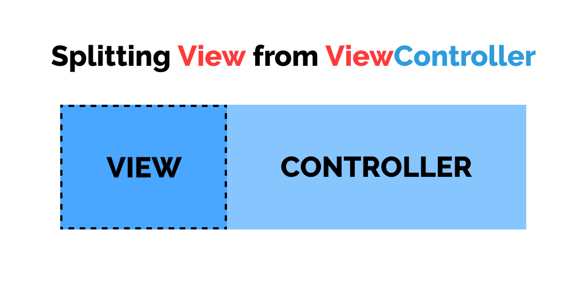
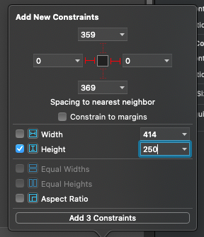
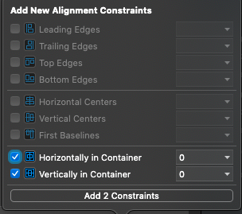
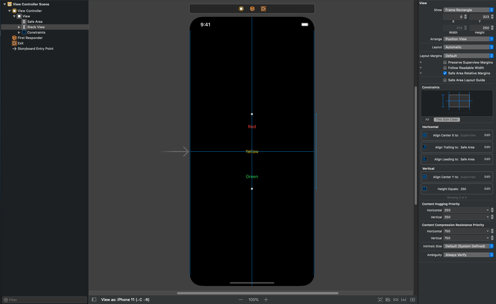
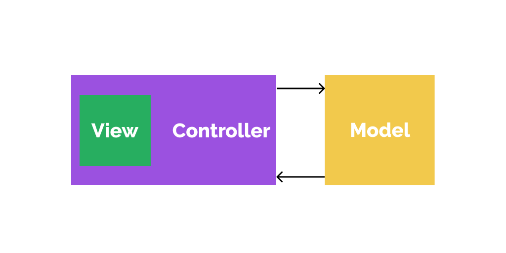
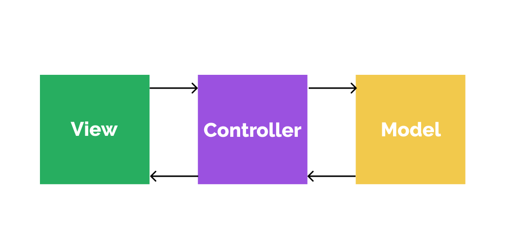

# Introduction 

In this post, I will explain how we can split view code to separate UIView subclass and leave the UIViewController to do the job it is supposed to do. i.e, control the view 🤷‍♂️



If you're like me, who loves to code all the layout in code and suffer the ugliness of bloated UIViewController later?. Then this article will help you refactor the **UIView** code from **UIViewController** in a clean and quick way without compromising *maintainability* and *readability*. This technique also helps us to enforce the **Single Responsibility Principle** in our code.


# Problem

To understand it clearly, We'll create a **UIViewController** with 3 buttons: Red, Yellow, Green. When these buttons are tapped, an alert is shown. 
To compare and contrast the benefits of modular UIViewController, We'll create the UIViewController implementation on both Storyboard and Pure code.

### The storyboard way
1. create a new project, name it whatever you want.
2. Open **Main.storyboard**, select the view controller.
3. Add a **UIStackView** and add 3 buttons.
4. Name the buttons Red, Yellow, Green and change their colors to their respective name.
5. Add **Leading** and **Trailing** constraints to UIStackView and set the Height to **250**.



6. Center the UIStackView horizontally and vertically.



With all done, the layout should look something like this...



Now open the ViewController.swift file and create **IBActions** for interacting with the buttons.

```swift:title=ViewController.swift {5,9,13}
import UIKit

class ViewController: UIViewController {

    @IBAction func redButtonTapped(_ sender: Any) {
        
    }
    
    @IBAction func yellowButtonTapped(_ sender: Any) {
        
    }
    
    @IBAction func greenButtonTapped(_ sender: Any) {
        
    }
}

```

Now define a `showAlert()` function that presents a UIAlertViewController with the given title.

```swift

func showAlert(title:String){
    let alertVC = UIAlertController(title: title, message: nil, preferredStyle: .alert)
    let okButton = UIAlertAction(title: "OK", style: .default)
    alertVC.addAction(okButton)
    present(alertVC, animated: true)
}

```


Now call the `showAlert()` function in **IBAction** of each button

```swift:title=ViewController.swift 
import UIKit

class ViewController: UIViewController {

    func showAlert(title:String){
        let alertVC = UIAlertController(title: title, message: nil, preferredStyle: .alert)
        let okButton = UIAlertAction(title: "OK", style: .default)
        alertVC.addAction(okButton)
        present(alertVC, animated: true)
    }
    
    @IBAction func redButtonTapped(_ sender: Any) {
        showAlert(title: "Stop!")
    }
    
    @IBAction func yellowButtonTapped(_ sender: Any) {
        showAlert(title: "Get Ready!")
    }
    
    @IBAction func greenButtonTapped(_ sender: Any) {
        showAlert(title: "Go Go Go!")
    }
}
```

Now build and run the app, It should look something like this


That's it for the storyboard part. Now if we see the view controller code, it hardly takes ~16 lines for this whole setup since Storyboard takes care of splitting the view from Viewcontroller internally.

### The Code way

While we have advantages on storyboard over code like implementing layout of views in less time, WYSWYG (What You See is What You Get), Static table views, etc. It also has annoyingly bad disadvantages like merge conflicts, compilation time, slow loading of storyboard on XCode, and much more. These are the reasons why I almost all the time write apps in pure code without using storyboards.

Its time for the iOS ninja technique where we can have full control over view code unlike storyboard which abstracts the view. We'll implement the same layout and functionality but without the help of storyboards. 


> The way I'm about to implement in pure code is the way I have seen many beginner developers use it to define their view controller functionality in code.

Now you can create another project or just delete everything you implemented.

Now let's implement the same functionality but in code

```swift:title=ViewController.swift
import UIKit

class ViewController: UIViewController {

    let holdingStackView = UIStackView()
    let redButton = UIButton()
    let yellowButton = UIButton()
    let greenButton = UIButton()
    
    override func viewDidLoad() {
        
        //setup buttons
        redButton.setTitle("Red", for: .normal)
        redButton.setTitleColor(.systemRed, for: .normal)
        redButton.addGestureRecognizer(UITapGestureRecognizer(target: self, action: #selector(redButtonTapped(_:))))
        
        yellowButton.setTitle("Yellow", for: .normal)
        yellowButton.setTitleColor(.systemYellow, for: .normal)
        yellowButton.addGestureRecognizer(UITapGestureRecognizer(target: self, action: #selector(yellowButtonTapped(_:))))
        
        greenButton.setTitle("Green", for: .normal)
        greenButton.setTitleColor(.systemGreen, for: .normal)
        greenButton.addGestureRecognizer(UITapGestureRecognizer(target: self, action: #selector(greenButtonTapped(_:))))
        
        // add to stackview
        holdingStackView.addArrangedSubview(redButton)
        holdingStackView.addArrangedSubview(yellowButton)
        holdingStackView.addArrangedSubview(greenButton)
        
        //setup stackview
        holdingStackView.axis = .vertical
        holdingStackView.distribution = .fillEqually
        holdingStackView.backgroundColor = .red
        
        //add to view
        view.addSubview(holdingStackView)
        
        //setup constraints
        setupConstraints()
    }
    
    func setupConstraints(){
        holdingStackView.translatesAutoresizingMaskIntoConstraints = false
        NSLayoutConstraint.activate([
            holdingStackView.leadingAnchor.constraint(equalTo: view.leadingAnchor),
            holdingStackView.trailingAnchor.constraint(equalTo: view.trailingAnchor),
            holdingStackView.centerXAnchor.constraint(equalTo: view.centerXAnchor),
            holdingStackView.centerYAnchor.constraint(equalTo: view.centerYAnchor),
            holdingStackView.heightAnchor.constraint(equalToConstant: 250)
        ])
    }
    
    @objc func redButtonTapped(_ sender:UITapGestureRecognizer){
        showAlert(title: "Stop!")
    }
    
    @objc func yellowButtonTapped(_ sender:UITapGestureRecognizer){
        showAlert(title: "Get Ready!")
    }
    
    @objc func greenButtonTapped(_ sender:UITapGestureRecognizer){
        showAlert(title: "Go Go Go!")
    }
    
    func showAlert(title:String){
        let alertVC = UIAlertController(title: title, message: nil, preferredStyle: .alert)
        let okButton = UIAlertAction(title: "OK", style: .default)
        alertVC.addAction(okButton)
        present(alertVC, animated: true)
    }
    
}
```

🤯 Woah! the same implementation took whooping **~65** lines of code. That's **4x** times code than what we can achieve with the storyboards.


If you notice, the view code is handled by viewcontroller, which totally violates the **MVC (Model-View-Controller)** architecture and **Single Responsibility Principle**. Currently, our code architecture looks like this



Which clearly indicates the violation of **MVC** and **SRP**. This is one of many reason why some developers refer **MVC** as **Massive-View-Controller** 😆.

# Solution

As we can see, just for simple layout implementation, it takes 4x times code than storyboards just for setting up views and adding a tap gesture.
This type of implementation completely violates the **Single Responsibility Principle** and **Model-View-Controller** architecture. Fortunately, we can solve this problem by moving the view to code to a separate UIView subclass.

Let's take out the view code from UIViewController and make it a separate UIView class.

> Tip: You should name your UIView subclass file according to the viewcontroller. for eg LoginViewController view class will be LoginView.

In our case, We have ViewController file, let's assume TrafficViewController, so we will name out UIView subclass as TrafficView.

First, create a TrafficView as a subclass of UIView

```swift:title=TrafficView.swift
class TrafficView: UIView {
    
    override init(frame: CGRect) {
        super.init(frame: frame)
        self.frame = frame
        setupViews()
    }
    
    required init?(coder: NSCoder) {
        super.init(coder: coder)
    }
    
    func setupViews(){
        //setup views here
    }
    
    func setupConstraints(){
        //setup view constraints
    }

}

```

Now refactor the View code from ViewController to TrafficView

```swift
class TrafficView: UIView {
    
    private let holdingStackView = UIStackView()
    private let redButton = UIButton()
    private let yellowButton = UIButton()
    private let greenButton = UIButton()
    
    override init(frame: CGRect) {
        super.init(frame: frame)
        self.frame = frame
        setupViews()
    }
    
    required init?(coder: NSCoder) {
        super.init(coder: coder)
    }
    
    func setupViews(){
        
        //setup buttons
        redButton.setTitle("Red", for: .normal)
        redButton.setTitleColor(.systemRed, for: .normal)
        redButton.addGestureRecognizer(UITapGestureRecognizer(target: self, action: #selector(redButtonTapped(_:))))
        
        yellowButton.setTitle("Yellow", for: .normal)
        yellowButton.setTitleColor(.systemYellow, for: .normal)
        yellowButton.addGestureRecognizer(UITapGestureRecognizer(target: self, action: #selector(yellowButtonTapped(_:))))
        
        greenButton.setTitle("Green", for: .normal)
        greenButton.setTitleColor(.systemGreen, for: .normal)
        greenButton.addGestureRecognizer(UITapGestureRecognizer(target: self, action: #selector(greenButtonTapped(_:))))
        
        // add to stackview
        holdingStackView.addArrangedSubview(redButton)
        holdingStackView.addArrangedSubview(yellowButton)
        holdingStackView.addArrangedSubview(greenButton)
        
        //setup stackview
        holdingStackView.axis = .vertical
        holdingStackView.distribution = .fillEqually
        holdingStackView.backgroundColor = .red
        
        //add to view
        addSubview(holdingStackView)
        
        //setup constraints
        setupConstraints()
    }
    
    func setupConstraints(){
        holdingStackView.translatesAutoresizingMaskIntoConstraints = false
        NSLayoutConstraint.activate([
            holdingStackView.leadingAnchor.constraint(equalTo: leadingAnchor),
            holdingStackView.trailingAnchor.constraint(equalTo: trailingAnchor),
            holdingStackView.centerXAnchor.constraint(equalTo: centerXAnchor),
            holdingStackView.centerYAnchor.constraint(equalTo: centerYAnchor),
            holdingStackView.heightAnchor.constraint(equalToConstant: 250)
        ])
    }
    
    @objc private func redButtonTapped(_ sender:UITapGestureRecognizer){
        //red button tapped
    }
    
    @objc private func yellowButtonTapped(_ sender:UITapGestureRecognizer){
        //yellow button tapped
    }
    
    @objc private func greenButtonTapped(_ sender:UITapGestureRecognizer){
        //green button tapped
    }
}
```

But how does viewcontroller know which button is tapped?

🦸‍♂️ **Delegate to the rescue!!** ⚡️

> You can also use closures instead of Delegates.

create a TrafficViewDelegate to signal viewcontroller that button is tapped.

```swift
protocol TrafficViewDelegate:class {
    func redButtonTapped()
    func yellowButtonTapped()
    func greenButtonTapped()
}
```

Now add a delegate property in TrafficView and signal the delegate when the button is tapped.

```swift
class TrafficView: UIView {

    /* ... */

    weak var delegate: TrafficViewDelegate? = nil

    /* ... */

    @objc private func redButtonTapped(_ sender:UITapGestureRecognizer){
        delegate?.redButtonTapped()
    }
    
    @objc private func yellowButtonTapped(_ sender:UITapGestureRecognizer){
        delegate?.yellowButtonTapped()
    }
    
    @objc private func greenButtonTapped(_ sender:UITapGestureRecognizer){
        delegate?.greenButtonTapped()
    }
}
```

Now implement TrafficView in ViewController

```swift 
class ViewController: UIViewController, TrafficViewDelegate {

    let trafficView = TrafficView()
    
    override func viewDidLoad() {
        view = trafficView
        trafficView.delegate = self
    }
    
    func showAlert(title:String){
        let alertVC = UIAlertController(title: title, message: nil, preferredStyle: .alert)
        let okButton = UIAlertAction(title: "OK", style: .default)
        alertVC.addAction(okButton)
        present(alertVC, animated: true)
    }
    
    func redButtonTapped() {
        showAlert(title: "Stop!")
    }
    
    func yellowButtonTapped() {
        showAlert(title: "Get Ready!")
    }
    
    func greenButtonTapped() {
         showAlert(title: "Go Go Go!")
    }
    
}
```

We can set View to the ViewController as simple as

```swift {4} noLineNumbers
class ViewController: UIViewController, TrafficViewDelegate {
    /* ... */

    override func viewDidLoad() {
        view = trafficView //1
        trafficView.delegate = self //2
    }

    /* ... */
}
```


1. Setting a View to the ViewController
2. Setting the Delegate to receive tap events


As you can see how thin our UIViewController becomes when we split the UIView code to other file.
Now go ahead, run the app, you will see the same output but with a good quality of code.

Now since we moved the View code out of ViewController, our code architecture looks like



# Conclusion

The code looks cleaner than ever. The code quality isn't only the thing we achieved but we also enforced our code to follow the **Model-View-Controller** and **Single Responsibility Principle** by splitting UIView code from UIViewController.

### Before you leave

If you have any constructive criticism or any questions, please drop an email at [hello@dvlper.in](mailto:hello@dvlper.in) or ping me in [instagram](https://instagram.com/dvlp.er). I'll be happy to hear your feedback.

Follow me on  [ Github](https://github.com/devwaseem), [Twitter](https://twitter.com/iamwaseem99), [Instagram](https://www.instagram.com/dvlp.er/), [Facebook](https://www.facebook.com/dvlprwaseem), [LinkedIn](https://www.linkedin.com/in/devwaseem/).

