import Gist from "react-gist"

### Whoami

Hi, My name is __Waseem Akram__ a.k.a **DVLPER**. I make web apps, mobile apps, hunt bugs, and design a little bit of User Interfaces.
Well, I'm here to share with you the wonderful but boring story of mine on how I got introduced to programming and making stuffs I like and much more. So get ready with the time machine, because we are going to travel back and forth to important moments in time.


*Let's go back to my childhood...*

---


### Journey to the center of my childhood


I have been a computer enthusiast since my childhood. I like to play and break computers, explore the unknown realm of the computer world. Since then I have been curious how these magic boxes (computers) works. But a bummer, all I had is a mediocre desktop with limited and bad internet connection (internet wasn't that famous those days). I started learning how basic components like printers, scanners, modems, etc,. works. Also, I broke a lot of things from software (operating systems by misconfiguration) to hardware in the way of exploration. Thanks to my dad for getting it fixed every time.

_Nothing interesting here. let us go a little forward in time now._


---

### Geek! Not Nerd!!


We're here in 2012. I'm now a 13-year-old calling myself a geek 😆, because that was the time I owned my first Android phone, an old little Micromax touch phone.
I have used phones before, obviously an Android but that belongs to my parents so I didn't have much freedom to explore and break things.
When I got my phone, things started getting rigor. I have learned a lot about Android, iPhones, their models, and specs.
I started tweaking around the Android and installing various launchers to customize it the way I want. 
One fine day, I got introduced to [rooting](https://en.wikipedia.org/wiki/Rooting_(Android)) and you would've expect it. I rooted my phone ignoring those scary warnings about the security issues and [bricking](https://en.wikipedia.org/wiki/Brick_(electronics)) problems. Since then it changed the way I look at technology. How manufactures restrict users, and how rooting breaks out the restriction and allows freedom to customize it in kernel level. Also that was the first time I got introduced to the term **`Hacking`**. I installed a lot of tweaks, apps, and patched games, etc, I pretty much enjoyed the process and the thrill of rooting (because if I brick, all I had to do is throw it away or spend some lump money to fix which will never be an option for me) and the benefits I gained after rooting. 
Apart from geeky stuffs I did Photoshop, Video editing using [nero vision](https://en.wikipedia.org/wiki/Nero_Vision).

_Lets leave. come on get in the time machine..._

---


## The Siri tragic


Huh! It is 2014. I'm 15 now, usual studies and exams bored me as always. One fine day, My dad bought me an iPhone 4, that's the first iPhone I had. That small incredible device is a masterpiece (Thanks to Steve jobs). The speed, smoothness, and camera quality blew my mind. I loved every moment with it. Well time passed, you would've guessed it by now, **ITS TIME TO JAILBREAK!!!** (Jailbreak is similar to rooting). Again I started enjoying the benefits and freedom of tweaking.

- There wasn't a bluetooth file transfer feature in the iPhone. Installed a tweak, got it.
  
- No file manager? no problem.
  
- Need some points or money in games? no problem.
  
- Download movies and music directly to Apple Music and Movies app? no problem.
  
Jailbreak was like a buff for iPhone. Features were not just an imagination on those days. Then I got to know about **SIRI**. Who didn't want a talking smart assistant on their phone? But Siri wasn't natively available for iPhone 4. Well, let us install the SIRI using [cydia](https://en.wikipedia.org/wiki/Cydia) (its a package manager where you can install jailbreak tweaks) then. Let me risk it, what could go wrong right? fingers crossed 🤞.


Something went wrong with installation or dependencies I think, or it wasn't just built for the iPhone 4.

My incredible iPhone got bricked 😭

This is one of the most regretting moments in my life.


I could have just fixed it by formatting everything back to normal but the internet was expensive those days and the firmware files were more than a gig in size. No problem lets fix it.

I bought the internet pack and started downloading firmware files. **Fingers crossed again 🤞.**


**99% and FAILED!!!**


I can't afford another data pack. so I just gave up. Bye Bye iPhone 😢

_Sad times. let us get going..._

---


## The Game of Roms


Its Year 2014, A 16-year-old playing with Android. Yeah I'm back to Android after I messed up my iPhone. since then I had many Android phones changed but in every Android phone that I ever owned I did the same thing which is far from rooting. This time I started playing with the [Android roms](https://en.wikipedia.org/wiki/List_of_custom_Android_distributions) (Android ROMs are just modified Android os) and different [kernels](https://en.wikipedia.org/wiki/Kernel_(operating_system)), [bootloaders](https://en.wikipedia.org/wiki/Booting), recovery images,etc., available for the specific device I had. I would change the Android rom as frequently as 2-3 per week just because it was fun to do. Basically, I was addicted to that for a long time. I didn't want to stay there but I wanted to learn how the operating system works. That's how I got introduced to [`Linux`](https://en.wikipedia.org/wiki/Linux). I was a beginner and a windows user, so Linux is scary as well as fun for the first time. Out of curiosity i learned [Bash Scripting](https://en.wikipedia.org/wiki/Bash_(Unix_shell)) and made [Intelli Tweaks](https://forum.xda-developers.com/Android/software-hacking/mod-intelli-tweaks-t3159308).

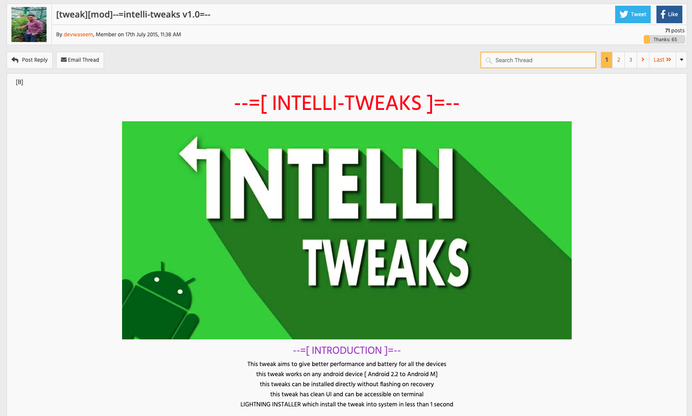
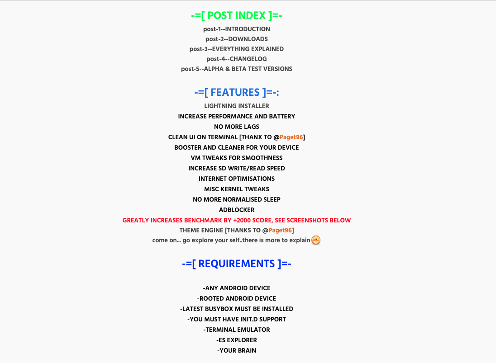

<a href="https://forum.xda-developers.com/Android/software-hacking/mod-intelli-tweaks-t3159308" >Click here to check it out</a>

**Intelli tweaks**, as the name suggests, Its a tweaking script for rooted Android phones which will buff your phone's performance; You may have to take a look at what it can do and make sure you read the comments too 😅. To be honest, I copied a few features from others and added to mine and made my tweaks look unique.

_Thats the first-ever **code/project** I ever wrote. **Proud Moment**_ 🎉.

<!--  -->


I didn't know much about coding/programming or programming languages was back then. I was just doing everything out of curiosity by reading others works and guides online.

Sometime back then I also learned `Ethical Hacking`. Basic XSS, SQL Injections, Directory path traversals, and a quite few. One day an old Indian website caught my eye with an admin login page. Well my curiosity didn't stop me to apply SQL injection and the next minute I was inside the website's admin panel. So creepy and Scary. while I was looking around I accidentally clicked something that made the whole website go nuts and turn off. I didn't wanna do anything but to come out of it. The second day I found that it is fixed. Turned out the first website I **hacked**. Another **Proud Moment** 🎉.

_Whatever! Its time!. Let us jump a year_

---

## Oh wait, I can C

We're in 2015, the year where it all started. I was a biology student in my highschool. Why? because I actually chose biology over computer science because I thought choosing CS will bore me easily and also I love biology. Time to learn something new!. One day our biology teacher was on leave so we stayed back in the CS class. That day was the quiz day for the CS class. I was sitting behind in the corner and answering almost all the questions correctly. CS teacher complimented me in front of the whole class and asked me _" How are you able to answer all those questions? "_ (Honestly those were basic questions not rocket science). I answered _"Its basics and I feel computer science is too easy "_.

A friend of mine, out of rage 😤 came to me and made a **dare** asking me to compile a **C program**, *" I'm not asking you to run but just successfully compile a c program "*  were his words.


I took it seriously and couldn't forget it. I went home from school. Took my laptop started searching what the heck is C programming anyway? (Honestly, I had no idea what is C programming and programming languages are until that day).

_Okay it is interesting, we can make computers do things whatever we want. It's basically a superpower! let's learn then?_

I borrowed an old C programming book from a friend (the Internet wasn't a choice still). I started learning and wrote my first ever __Hello World__ program.

```c
#include<stdio.h>

int main(){
    printf("Hello Waseem!");
    return 0;
}

```

_What? I made computer talk? Wow cool_

That was an easy program. I mean the easiest program ever. So I didn't have any problem until I started digging into it more. The more I learnt the more I got warnings and errors.

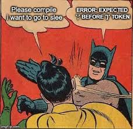


 But going through the book again with what I have learned clearly helped me solve all those problems. It's just the compiler is expecting me to write code that it can understand, not some gibberish like missing a semicolon or syntax errors.

_so sweet of you compiler._

I was so curious. I learned variables, various data types, conditionals, loopings. But something stopped me progressing and that's Functions, Structs and Pointers.

I asked myself _"What the heck is Functions? Structures? Pointers?"_.

I was tired understanding those and honestly I couldn't. So I gave up hoping one day I could be able to understand those.

_Back to time machine_

---

## The Comeback

It is early 2016 now. I'm on summer vacations after those long hectic board exams. Bored and got nothing to do except playing games. One day I have decided to join a institution that can teach me C programming. That's how I joined NIIT (National Institute of Information Technology) and opted for C, C++, Data Structures, and Java course ( bad for wallet obviously but it turned out to be the best decision of my life ).


I was able to learn Functions, Structures, and many more finally. Also this was my first ever biggest dumb program I wrote. It just finds the repeated character in a word that you enter.

> _Alert: Its 150+ lines long, you may have to scroll fast._

<Gist id="614aa4ffb4dc965d6418422968c34c1d" />


I was happy that I could write my own programs now. And I didn't stop there. I completed learning C with all those things that I wasn't able to understand in the past. I eventually moved to C++ where I learned OOPS (Object-Oriented Software Programming). Classes, Objects, Encapsulation, Abstraction, Polymorphism, and all other was so much fun learning. I made sure I didn't stop learning and making things. Sometime later I moved to data structures, where I learned all those basic data structures form stacks, queues to trees, and heaps.

---

## Dawn of the planet of the Apps


It's Mid 2016, Passed C, C++, Data structures exams and moved on to **Java** Class. But a bummer there, Only one Java class per week. So I have to wait for a week to learn something new. Dammit!. I didn't have patience so I started learning Java on my own. Java was as fun as C and C++ because all the basic core concepts were the same, Syntax is different (Many other factors too but I'm simplifying here). Java classes bored me because I learned the concepts beforehand that they teach in class. I kept exploring, coding stuffs...

_This is one of a early programs I wrote and I am proud of_
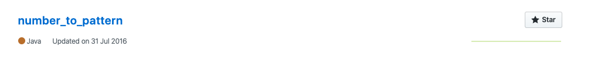
[Click here to take a look](https://github.com/devwaseem/number_to_pattern)

One fine day, I got a million-dollar question in my mind:

_"Why am I learning all this? What can I potentially make something better out of this?"_

That's when I really want to make use of my coding skill and started Googling. I found out I can make Android Apps since I know Java. Wait no more......

I started learning `Android Programming` in [Udacity](https://www.udacity.com/) and I gradually started making little basic Android apps.

I Moved to College a few months later. I always had a mind for solving problems. I saw a problem with the timetable. wait no more I made a Time Table App that can not only show you what class is right now but also remind you what's next. Don't mind the name please 😅.

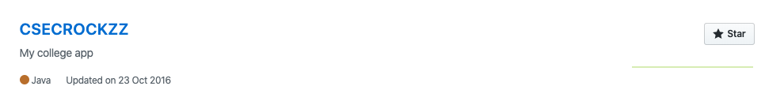
[Click here to take a look](https://github.com/devwaseem/CSECROCKZZ)

_That was my first successful Android project_ 🎉

Since then, I was always curious to learn the concepts in depth be as it Android or any programming languages.

A few months later, a Hackathon was conducted in my college where I created an app for our college bus which will update live status and route of the bus and also alert the students when the bus is near 100-300 meters.

_(Unfortunately I lost the code, so I can't able to link it here)_

I have made a lot of apps since then, met a lot of people, made friends, helped a lot of people, made some money too 🤑.

In 2017, I bought a Macbook Pro 2012, until then I used an old dell laptop with 2 gigs of ram. Imagine running an Android studio in an < 2 Gb RAM. Its a nightmare.

 The same year, I found a problem to solve it again. I found a basic thing that WhatsApp is missing. That is a video cutting feature. I see a lot of people want to upload videos or songs that are more than 30 seconds but unfortunately there isn't a way unless they have to use a hard way by cutting the videos 30 seconds manually and upload the video as their stories in Whatsapp. Also there is no such app that can do it in the market.

I found that as an opportunity and made [__Klip Kutter__](https://play.google.com/store/apps/details?id=com.waseem.videotrimmerforwhatsapp&hl=en_IN). You would've guessed it by now. The App that can cut the videos into 30 seconds chunks which can make your life easy.

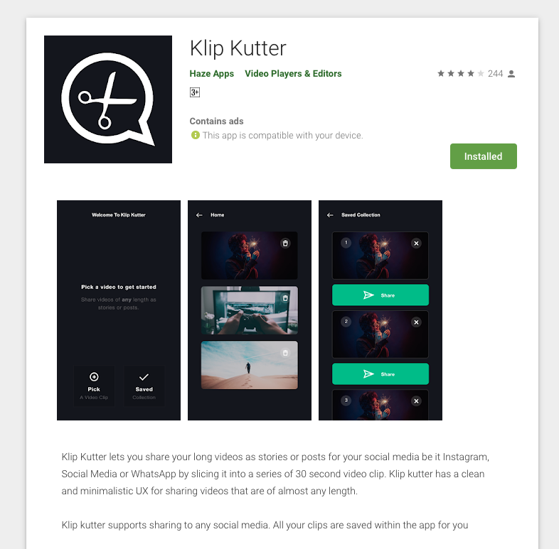
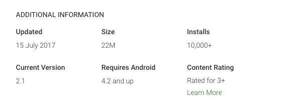

[click here to take a look](https://play.google.com/store/apps/details?id=com.waseem.videotrimmerforwhatsapp&hl=en_IN)

Its an instant hit from day 1, I was the first in the market. After a week many apps copied the same functionality and started to pop in the play store.


Then I got introduced to iOS App Development and learned `Swift` programming language. Honestly `Swift` is a breeze and beautiful. Swift is the second most language I love.

The first iOS app I made was Venturious. It wasn't my idea but a good friend/senior of mine [Haashir](http://haashir.in/).

Second, I created Facepass, both for Android and iOS. It is basically an app for anonymous messaging but powered with Facial Recognition.

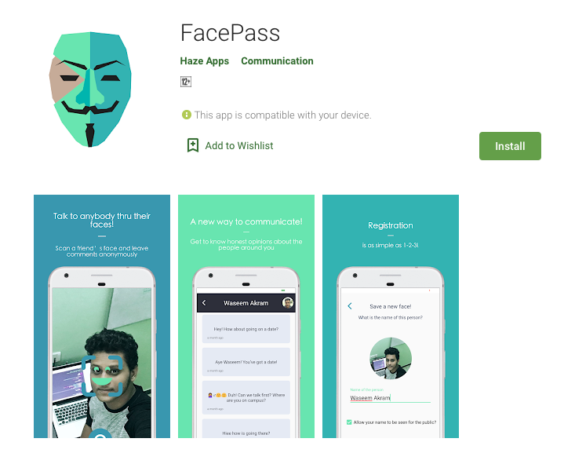

Producthunt: [https://www.producthunt.com/posts/facepass](https://www.producthunt.com/posts/facepass) <br/>
Github: [https://github.com/devwaseem/FacePass](https://github.com/devwaseem/FacePass)

Later, the same year. I was hired by a company called Veda and assigned to make an iOS app for Learn America LMS.

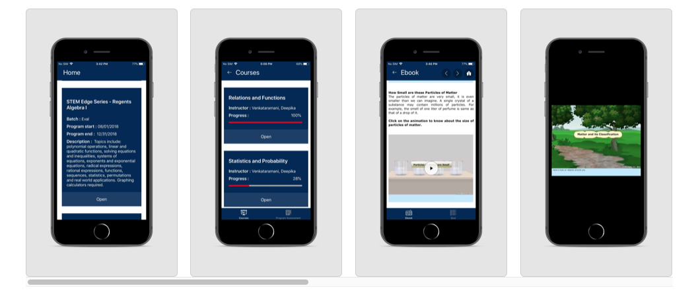

---

## Fast Forward

It's 2018, I learned `Kotlin` which is a programming language made for Android Apps. Kotlin is similar to Swift but unique in its own way. I love Coding using it. With that, I decided to make an app. I eventually landed making an App for our college. Its a note keeper app which will provide notes for your class if someone already uploaded. The app was powered by a Chatbot that I made. It was then uploaded to play store initially but recently I removed it because I wasn't getting a lot of active users.

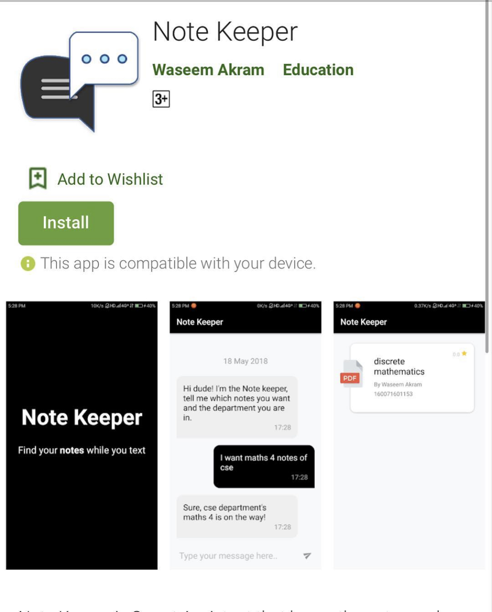

I also started learning Web Technologies the same year. I learned Node.js, React, Angular, Vue.js, and made a lot of web apps for myself and my clients while I was providing freelancing service. you can take a look at my [instagram](https://instagram.com/dvlp.er) for more stuffs.

Some of the Web apps are:

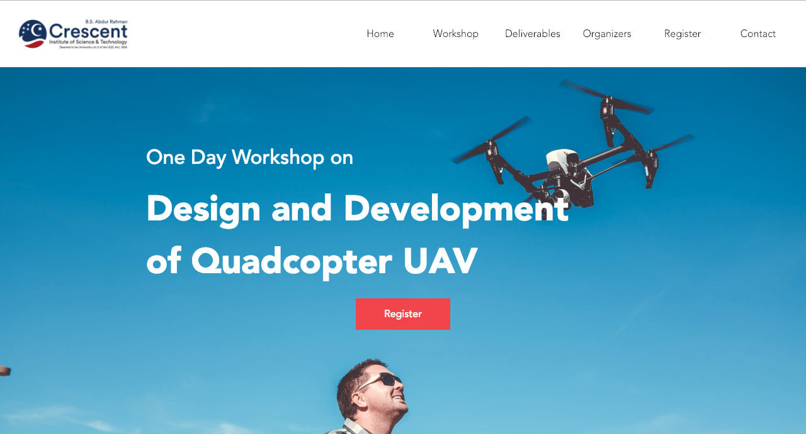

This is the website I have created for my college's workshop event.

In 2019, I created my portfolio website for freelancing.

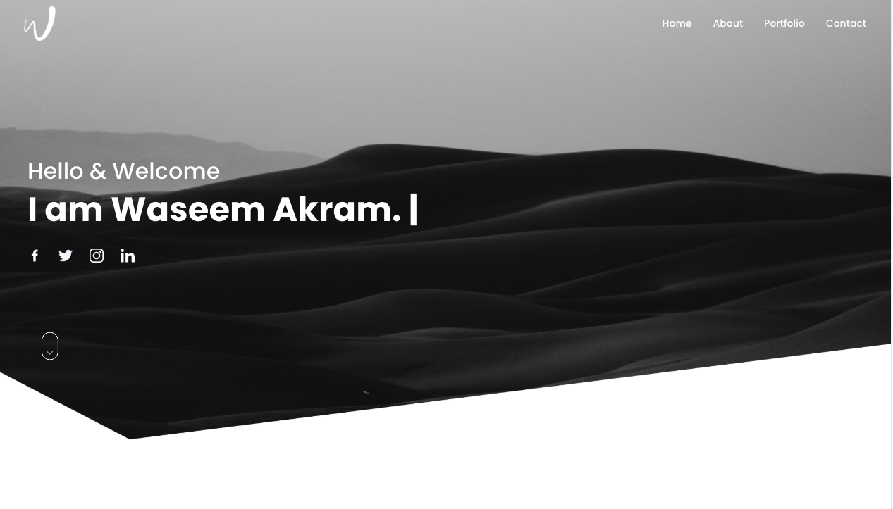

Link: [devwaseem.github.io](https://devwaseem.github.io/)

Later the same year and early 2019, I was also started learning and designing UI (User interface).

These are some of the designs

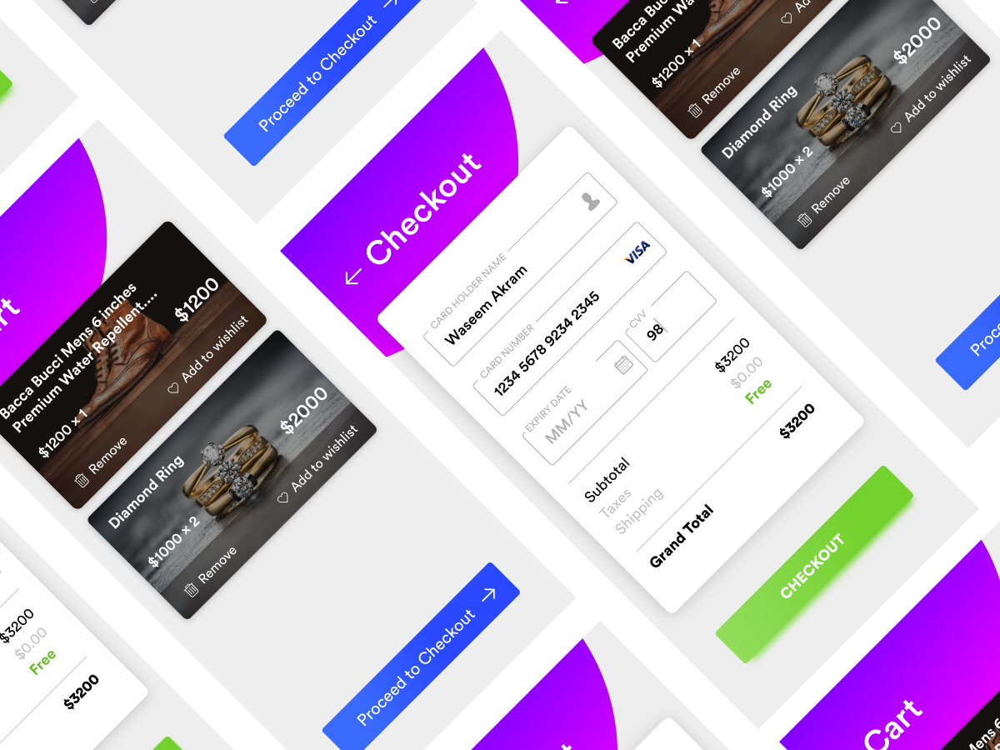

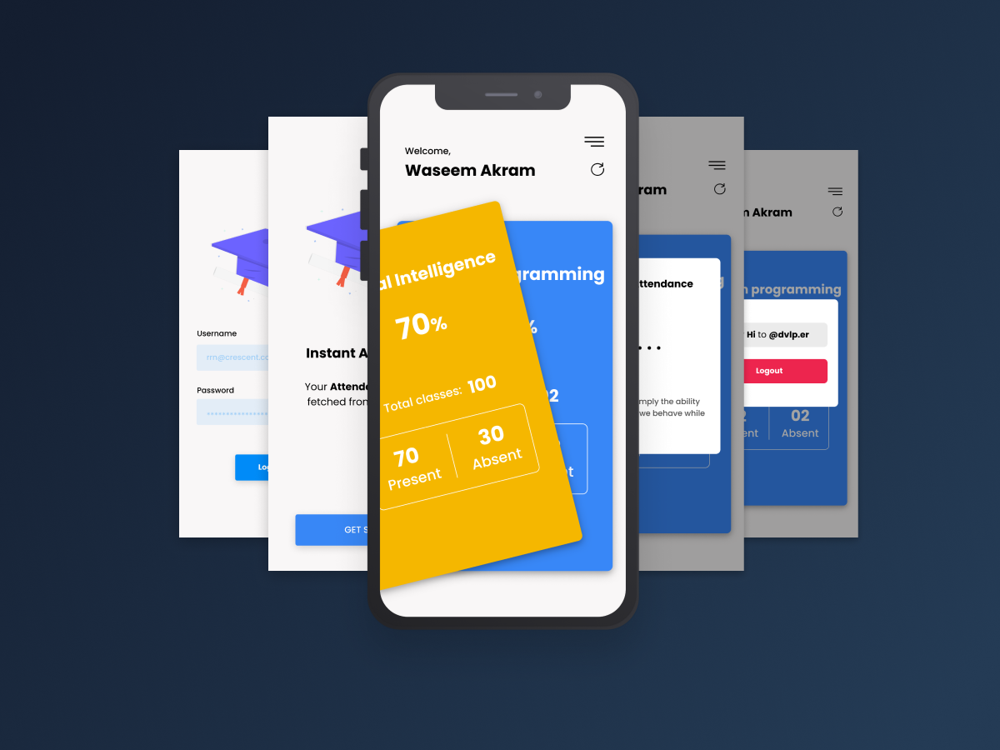

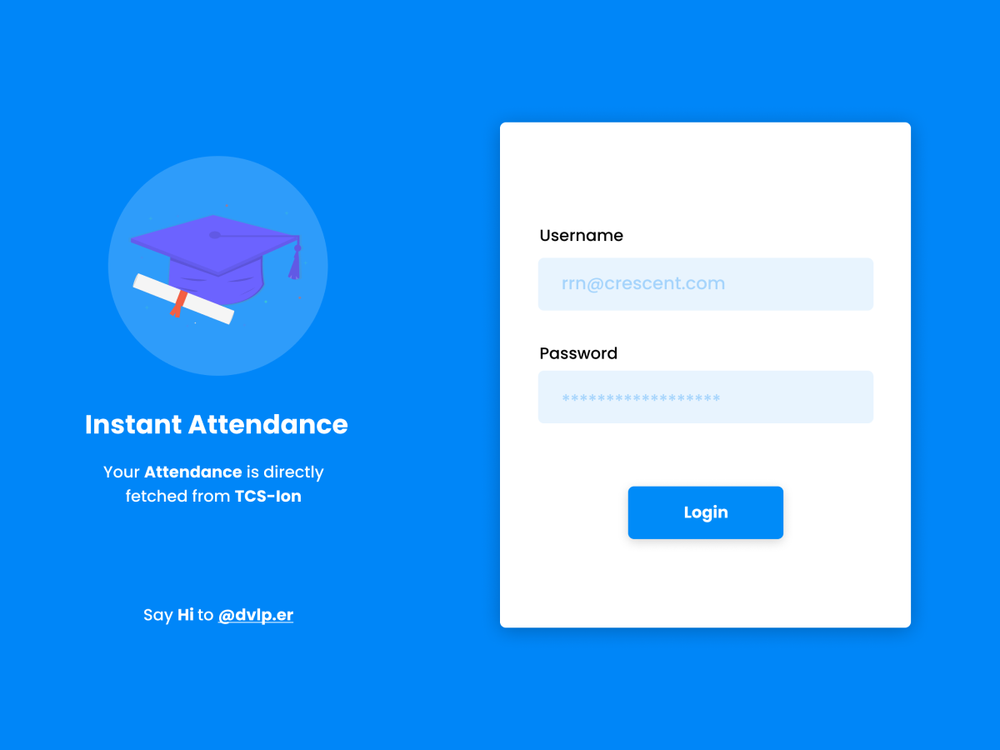

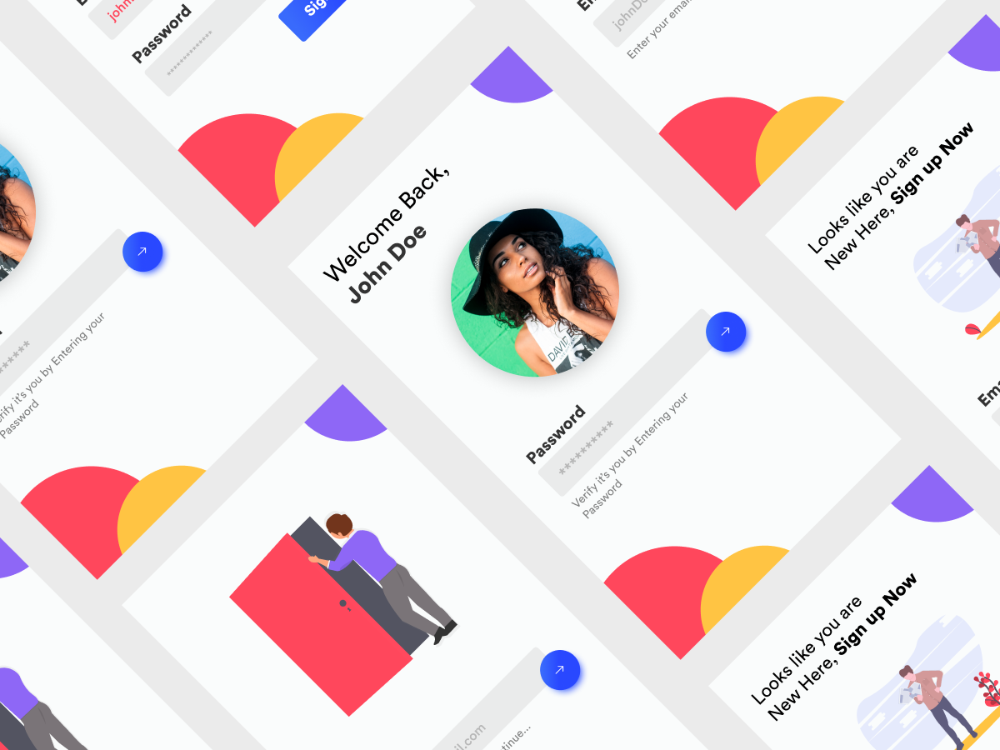

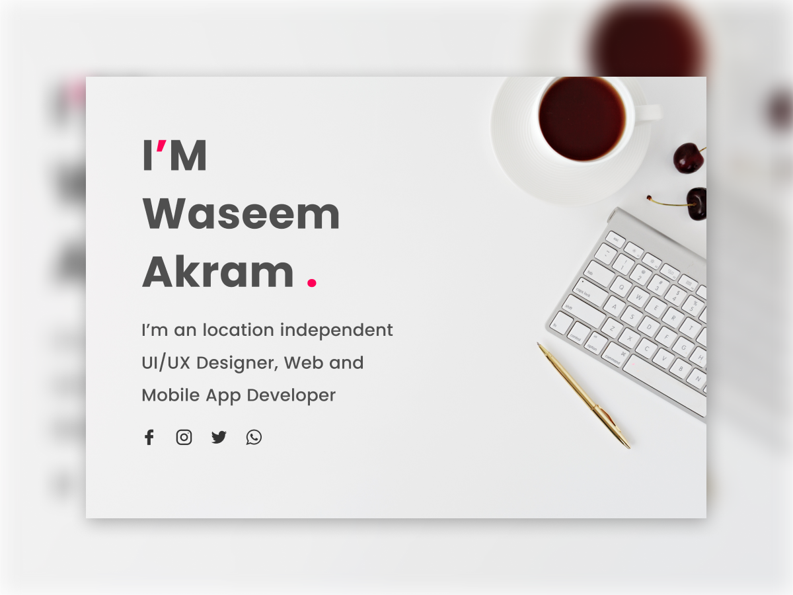

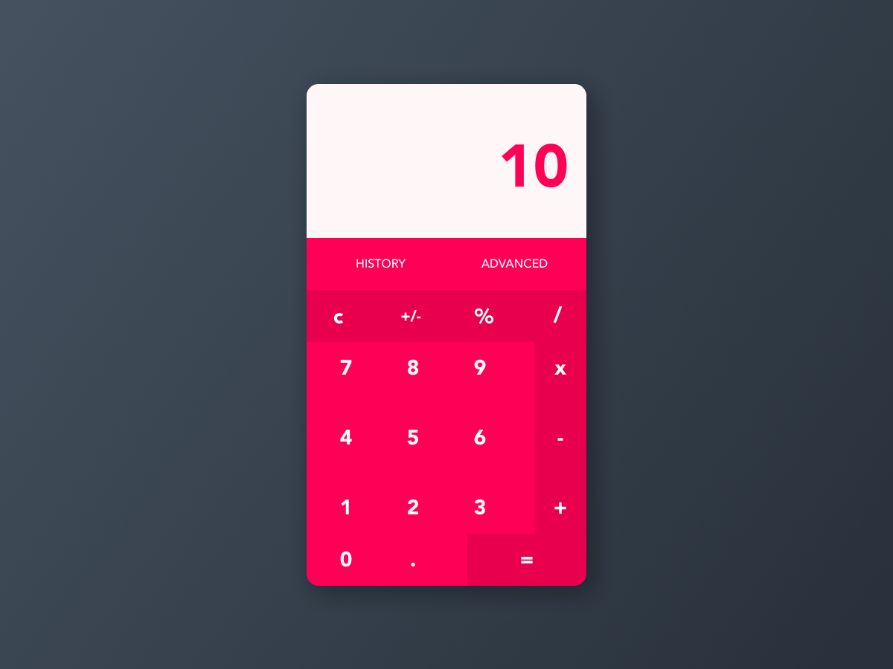

_Phewww.. Feeling tired after a long journey? let's go back to 2020 finally_ 😉.


---

## Present and Infinity

It's the year 2020, finally. This year I started learning `Ethical Hacking` again. Why? you ask. I know I am good at programming at the same time I love learning in-depth and exploring how internals works. The term Hacker isn't what I perceive as some guy doing bad things but as the guy who enjoys breaking and learning stuffs in depth. Basically I want to be a Hacker/security researcher because I love providing security and breaking it. Even my college final year project is based on the security field. I have love breaking stuff and learning things in-depth as you could've known by now if you read all the above sections.

I'm currently learning and breaking stuffs in a safe way with various labs and platforms. One of the platforms is tryhackme which provides a lab setup to learn and break systems.

I have also made a simple script called AnonymousBash. Which as the name suggests, it will proxy all your bash commands by tunneling it through the TOR network. 
Making you **Anonymous**

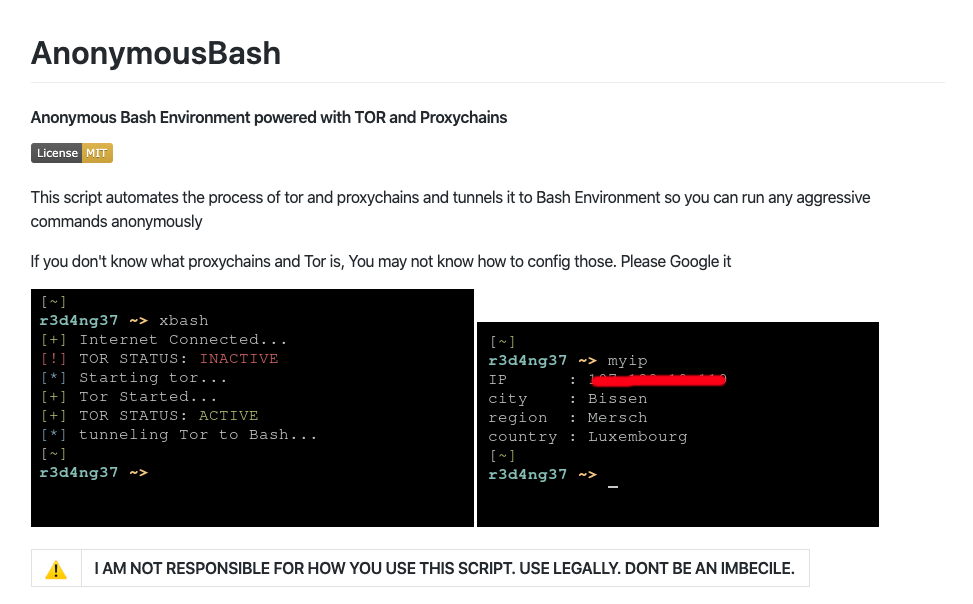

Link: [https://github.com/devwaseem/AnonymousBash](https://github.com/devwaseem/AnonymousBash)


I also play Capture the Flag in a while, which is a game for hackers or any cybersecurity enthusiast.

I have started this blog because I want to seed back the knowledge to the community. I'll post or share my writeups, research, walkthroughs, tips & tricks, and much more...

*I think that's it for now...*


---

## Before you leave

If you have any constructive criticism or any questions, please drop an email at [hello@dvlper.in](mailto:hello@dvlper.in) or ping me in [instagram](https://instagram.com/dvlp.er). I'll be happy to hear your feedback.

Follow me on  [ Github](https://github.com/devwaseem), [Twitter](https://twitter.com/iamwaseem99), [Instagram](https://www.instagram.com/dvlp.er/), [Facebook](https://www.facebook.com/dvlprwaseem), [LinkedIn](https://www.linkedin.com/in/devwaseem/).


